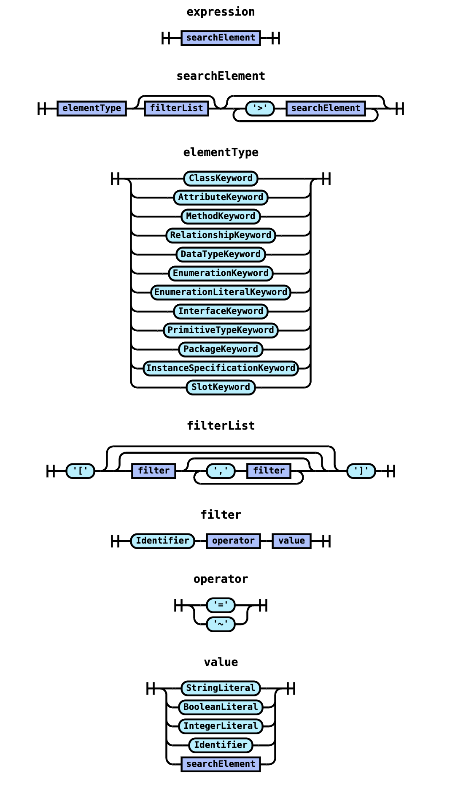

# Advanced Search with Improved Search Grammar and Replace Functionality

- Course: Advanced Model Engineering (SS 2027)
- Team Members: Crnkoci Lukas,Gahleitner Michael, Arslan Smajevic, Marko Vranjes, Abdyrakhmanova Aiana, Sultonmurodova Zebiniso
- University: TU Wien
- Submission Date: June 26, 2026

## 1. Introduction

This report presents the implementation of the Advanced Search with Pattern Matching feature developed for the bigUML project in Visual Studio Code. The purpose of this document is to explain the motivation behind the feature, outline the design decisions and implementation strategy, highlight key challenges, and discuss ideas for future improvements.

# ADD NEW DEMO HERE

<!-- DEMO -->
<p align="center">
  
</p>

## 2. Motivation and Purpose

The motivation and main objective of this project was to work on the search and replace feature inside the BigUML extension. We were to expand the existing search capabilites as well as add some better UI elements that should guide the user towards easier searching. On top of that, a new way of replacing speciffic parameters was also introduced.

## 3. Functionality Overview

Feature 1: SVG preview of searched elements

Feature 2: New search grammar for all elements in diagram

Feature 3: Replace mechanism combined with search

## 4. Features details

### Feature 2

Feature 2 introduces a typed search grammar that is parsed and evaluated on the backend. The implementation spans the browser webview, VS Code bridge, GLSP server action handler, a Chevrotain-based parser pipeline, and matcher-based evaluation on the UML model AST.

#### End-to-end workflow (query to evaluated results)

1. User enters a query in the Advanced Search webview (for example `Class[name~"User"]>Method[isQuery=true]`).
2. The browser component dispatches `RequestAdvancedSearchAction` with the raw query string:
    - `packages/big-advancedsearch/src/env/browser/advancedsearch.component.tsx`
    - `packages/big-advancedsearch/src/env/common/advancedsearch.action.ts`
3. The VS Code webview provider forwards and caches actions, then sends responses back to the webview:
    - `packages/big-advancedsearch/src/env/vscode/advancedsearch.webview-view-provider.ts`
4. The GLSP server receives the action in `AdvancedSearchActionHandler.handleSearch(...)`:
    - `packages/big-advancedsearch/src/env/glsp-server/advancedsearch.handler.ts`
5. For non-empty queries, the handler calls `buildAst(rawQuery)` to parse and validate the query.
6. The parsed criteria tree is passed to `ClassDiagramMatcher.matchAdvanced(...)`.
7. The matcher evaluates criteria recursively against the diagram model and returns matching `SearchResult[]`.
8. The handler returns `AdvancedSearchActionResponse` with the result list to the UI.

#### Where Chevrotain is used

The parser stack is implemented with Chevrotain in three layers:

- Lexer (`createToken`, `Lexer`):
    - `packages/big-advancedsearch/src/env/glsp-server/matchers/lexer.ts`
    - Defines tokens for element keywords (`Class`, `Method`, `Relationship`, ...), operators (`=`, `~`), brackets, comma, `>`, booleans, numbers, and strings.
- CST Parser (`CstParser`):
    - `packages/big-advancedsearch/src/env/glsp-server/matchers/parser.ts`
    - Grammar rules: `expression -> searchElement`, optional filter list, and child chaining via `>`.
- CST Visitor to AST:
    - `packages/big-advancedsearch/src/env/glsp-server/matchers/visitor.ts`
    - Converts parser CST into a typed `SearchCriteria` AST and validates filter semantics.

If tokenization or parsing fails, an exception is thrown and the action handler returns an empty result set.

When adding a new element, like for example say you were to add an element to be recognized as "SassyClass" - then you would have to add it here as an element. But beware of overlapping keywords, as his can be sometimes bad for chevrotain. https://chevrotain.io/docs/

And this is how the grammar looks like (from an abstract point of view): (can be generated with https://chevrotain.io/playground/, but needs converting to JS)
<p align="center">
  
</p>

#### Where the scope definitions live

Search filter scope and type definitions are centralized in:

- `packages/big-advancedsearch/src/env/common/search-filter-spec.ts`

`FILTER_SPECS` defines, for each filter key:

- `scopes`: which element types may use the filter (for example `name` on many scopes, `isQuery` only on `Method`, `source/target` on `Relationship`)
- `valueType`: expected value type (`string`, `boolean`, `number`)
- optional aliases/default operator

Resolution and validation helper:

- `packages/big-advancedsearch/src/env/glsp-server/matchers/search-schema.ts`
    - `findFilterSpec(scope, key)` maps a filter key to a valid spec for the current scope.

The AST visitor enforces these constraints in `validateFilters(...)`.

If you would like to add for example, `isAbstract` should searchable in `Relationship` as well - then add the `Relationship` to the `isAbstract` scope.

#### How the query AST looks

The typed AST model is defined in:

- `packages/big-advancedsearch/src/env/glsp-server/matchers/search-ast.ts`

Core shape:

- `SearchCriteria`
    - `type: SearchElementType`
    - `filters: SearchFilter[]`
    - `children: SearchCriteria[]`
- `SearchFilter`
    - `key`, `operator`, `value`
- `SearchValue`
    - one of `string | boolean | number | criteria`

Example AST for `Class[name~User]>Method[isQuery=true]`:

```json
{
    "type": "Class",
    "filters": [
        {
            "key": "name",
            "operator": "contains",
            "value": { "type": "string", "value": "User" }
        }
    ],
    "children": [
        {
            "type": "Method",
            "filters": [
                {
                    "key": "isQuery",
                    "operator": "equals",
                    "value": { "type": "boolean", "value": true }
                }
            ],
            "children": []
        }
    ]
}
```

#### How evaluation works on the model AST

The backend evaluates the search AST against the UML diagram AST (semantic model) in these stages:

1. Build candidate results and element index:
    - `ClassDiagramMatcher.match(...)` and `buildDiagramIndex(...)` in
      `packages/big-advancedsearch/src/env/glsp-server/matchers/classmatcher.ts`
2. Traverse semantic diagram nodes recursively using:
    - `packages/big-advancedsearch/src/env/glsp-server/matchers/sharedcollector.ts`
    - This walks nested Langium AST arrays (`entities`, `relations`, `properties`, `operations`, `parameters`, `values`, `slots`).
3. Evaluate each candidate with recursive predicate matching:
    - `matchesCriteriaOnElement(...)` in
      `packages/big-advancedsearch/src/env/glsp-server/matchers/matcher-utils.ts`
4. Evaluation checks:
    - element type compatibility (`Class` also matches `AbstractClass`, `Method` maps to `Operation`, `Attribute` maps to `Property`, `Relationship` covers all relation subtypes)
    - all filters on current node (`equals` and `contains` are actively produced by parser)
    - child criteria (`>` operator) by descending into structural children (`properties`, `operations`, `parameters`, etc.)
    - nested criteria values on relation endpoints (`source` / `target`) using the diagram index

In short: Feature 2 compiles user query text into a validated criteria AST (Chevrotain lexer + parser + visitor), then recursively evaluates that AST against the semantic UML model tree.

### Feature 3

Feature 3 adds a search-and-replace workflow on top of Feature 2. Once a query has produced a result set, the user can rewrite a chosen string property across the matched elements, preview every change before committing, include or exclude individual rows, and undo the whole batch. The implementation spans the shared protocol, a single shared replace-semantics module, a GLSP server action handler, the VS Code host bridge, and the replace UI in the webview.

#### End-to-end workflow (matched results to applied patch)

1. The user runs a search (Feature 2). The search response also carries a find pattern derived server-side from the parsed query, so the replace UI never has to re-parse the query and can never drift from its semantics.
2. The user expands the replace block (collapsed by default behind a chevron next to the shared search field), chooses the target property, enters or picks the replacement value, and optionally enables match-case.
3. The webview renders a per-row `old → new` preview for every result, computed locally with the exact same logic the server uses, so the preview is what the server will actually write.
4. The user can exclude individual rows, then trigger **Replace All** or a single-row replace. This dispatches a `RequestReplaceAction` with the included element IDs, the search pattern, the replacement, the selected property, and the case-sensitivity flag.
5. The GLSP server handler validates and rewrites each element, builds a JSON-patch batch, applies it through the GLSP command stack, and re-submits the model so the panel and diagram refresh.
6. The handler returns a per-row result list; each row shows an outcome icon (✓ changed / – no-op / ✗ error) and the panel offers an inline Undo button for the batch.

#### The replace protocol

Defined in `packages/big-advancedsearch/src/env/common/replace.action.ts`:

- `RequestReplaceAction` (webview → server): `elementIds`, `searchPattern`, `replaceWith`, optional `property` (defaults to `name`), and optional `caseSensitive`.
- `ReplaceActionResponse` (server → webview): `ok` plus a per-row `ReplaceResult[]` or a top-level `error`.
- `ReplaceResult` carries `oldValue`, `newValue`, `success`, and a `changed` flag that distinguishes rows actually mutated from no-ops and skipped/errored rows — this drives the per-row outcome icons.

The handler is registered alongside the search handler in `advancedsearch.module.ts`.

#### Shared replace semantics (preview equals commit)

Matching is literal substring matching, case-insensitive unless match-case is enabled. The logic lives in one place, `packages/big-advancedsearch/src/env/common/replace-semantics.ts` (`applyReplacement`), and is imported by both the server handler (the real mutation) and the webview (the per-row preview), so the two can never disagree. The search pattern is escaped before being used internally, and `$` in the replacement text is treated literally rather than as a substitution metacharacter.

#### Property selector and per-row preview (UI)

The replace block in `advancedsearch.component.tsx` lets the user target more than just the name:

- A `PROPERTY_CONFIG` map declares, per editable property, a label, an input type (free text or dropdown), and the allowed values for enum properties. The editable set is `name`, `value`, `visibility` (`PUBLIC/PRIVATE/PROTECTED/PACKAGE`), `aggregation` (`NONE/SHARED/COMPOSITE`), and `concurrency` (`SEQUENTIAL/GUARDED/CONCURRENT`).
- The server mirrors this with an `EDITABLE_FIELDS` whitelist in `classmatcher.ts`, and each `SearchResult` carries the current value of every editable property so the dropdowns and previews are populated from real data.
- For `name`, the find pattern comes from the query; for any other property the user supplies it directly (a dropdown for enum properties, free text otherwise).
- Each result row shows the computed `old → new` preview; rows lacking the property render `—` and stay disabled, and a hint summarizes how many of the included elements will change.

#### Safety rules

The server handler guards the dangerous edge cases:

- Property names are validated before being used to build the patch path.
- An empty search pattern is rejected (it would otherwise wipe values).
- A replacement that would clear a value is rejected per row and disabled in the preview, since empty names/enum values can't be represented in the textual model.
- Unknown elements, missing paths, and non-string properties yield a failed result for that row rather than aborting the batch; only changed rows produce patch ops.
- Patch failures are propagated so a failed replace reports `ok:false` instead of silently offering an Undo for a mutation that never happened.

#### Undo integration and model-change refresh

Replace is wired into the undo stack and kept in sync with external edits:

- The patch is applied through the GLSP command stack and submitted as a regular model operation, so the change registers with VS Code's undo stack, the dirty indicator, and save.
- The panel's inline Undo button sends an undo notification to the host, which routes a GLSP `UndoAction` to the active diagram client (the panel can't dispatch it itself).
- On any model change the host notifies the webview, which re-runs its current query (rather than reverting to the full element list) and retires a now-stale Undo button once the change falls outside a short grace window.

In short: Feature 3 reuses Feature 2's matched results, derives a safe find pattern from the parsed query, previews each edit with the exact same semantics the server applies, and commits the batch through the GLSP command stack so it is fully undoable.

## 8. Open Issues

### Feature 2
The search grammar could be coupled more with the grammar of the language. Instead of this, we did it manually and defined this in `packages/big-advancedsearch/src/env/common/search-filter-spec.ts`.

## 9. Future Improvements

Migrate the existing hard coded search paramaters from `packages/big-advancedsearch/src/env/common/search-filter-spec.ts` to use the `packages/uml-glsp-server/src/gen/common/model-types/class-diagram-model-types.ts`

## 10. Feedback about the course
